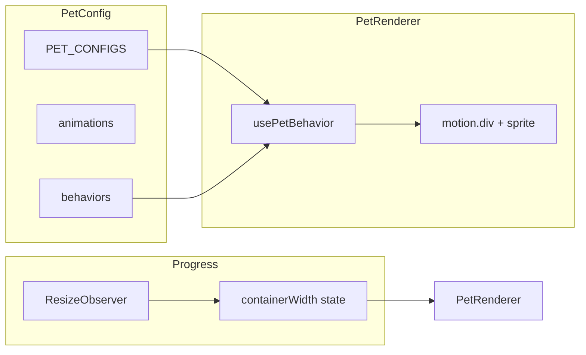

# Pet Animation System

This document describes how the pet animation system works: the config, behavior hook, and renderer, with examples and instructions for tuning sequences and speed.

---

## Overview

Pets are sprite-based characters that walk, idle, sit, and sleep along the bottom progress bar. Their behavior is driven by **timer mode** (focus vs break): each pet has separate behavior sets for `focus` and `break`. The system has three main parts:

1. **PetConfig** ([config/PetConfig.tsx](config/PetConfig.tsx)) – Defines each pet’s sprites, sizes, and behavior sequences.
2. **usePetBehavior** ([hooks/usePetBehavior.ts](hooks/usePetBehavior.ts)) – Chooses sequences, runs steps (walk vs stationary), and outputs position, action, and animation callbacks.
3. **PetRenderer** ([components/Pet.tsx](components/Pet.tsx)) – Renders the pet at the current position with the correct sprite and flip, and drives Motion animations.

The **Progress** bar ([components/Progress.tsx](components/Progress.tsx)) measures the pet container width with a `ResizeObserver`, passes it to each `PetRenderer`, and only mounts pets when `containerWidth > 0` so hooks run in a consistent order.



---

## 1. PetConfig – Structure and Types

All pet data lives in [config/PetConfig.tsx](config/PetConfig.tsx).

### 1.1 PetConfig

Each pet is a `PetConfig` with:

- **id** – String id (e.g. `'rottweiler'`, `'cat'`).
- **size** – Pixel size of one frame (sprites are square), e.g. `64`.
- **defaultScale** – Optional display scale (e.g. `2` for rottweiler).
- **animations** – Map of action name → sprite and timing.
- **behaviors** – `focus` and `break` arrays of **behavior sequences**.

### 1.2 AnimationConfig

Each animation used by the renderer has:

- **url** – Path to the sprite sheet image (e.g. `'/sprites/rottweiler/run.png'`).
- **frames** – Number of frames in the strip (horizontal).
- **speed** – Base duration in seconds for one full cycle (used for idle/sit/sleep; walk uses a derived speed).

Example from config:

```ts
animations: {
  idle: { url: '/sprites/rottweiler/idle.png', frames: 6, speed: 0.8 },
  walk: { url: '/sprites/rottweiler/run.png', frames: 5, speed: 0.4 },
  sit: { url: '/sprites/rottweiler/sit.png', frames: 8, speed: 0.6 },
  sleep: { url: '/sprites/rottweiler/sleep.png', frames: 8, speed: 1.0 },
},
```

### 1.3 BehaviorSequence and BehaviorStep

A **sequence** has a **name**, optional **weight** (for random choice), and an array of **steps**. Each step is either:

- **Movement** – `action`, `distance: { min, max }` (pixels), optional `direction: 'left' | 'right' | 'random'`.
- **Stationary** – `action`, `duration: { min, max }` (seconds).

Example sequence:

```ts
{
  name: 'patrol',
  weight: 3,
  steps: [
    { action: 'walk', distance: { min: 300, max: 900 }, direction: 'random' },
    { action: 'idle', duration: { min: 4, max: 10 } }
  ]
}
```

The **action** string must match a key in that pet’s `animations` (e.g. `'idle'`, `'walk'`, `'sit'`, `'sleep'`).

---

## 2. usePetBehavior – How Behavior Runs

The hook is called as:

```ts
usePetBehavior(petId, mode, containerWidth)
```

- **petId** – Key in `PET_CONFIGS` (e.g. `'rottweiler'`).
- **mode** – `'focus'` or `'break'` (from timer mode).
- **containerWidth** – Width of the pet container in pixels (from Progress).

It returns state used by the renderer: `currentAction`, `x`, `direction`, `duration`, `onAnimationComplete`, `isInitialized`.

### 2.1 Initialization and spawn

On mount or when `mode`, `petId`, or `effectiveWidth` (derived from `containerWidth`) changes, a `useLayoutEffect` runs:

1. **Spawn X** – Random position in the middle 60% of the bar (20%–80% of `maxPos = effectiveWidth - pet.size`), or `0` if there’s no room.
2. **State** – Sets `x`, `direction` (random left/right), `duration: 0`, and `isInitialized: true`.
3. **First sequence** – If `maxPos > 0`, calls `startNewSequence()` so the pet immediately starts a sequence.

So the pet appears already at its spawn position and then starts walking or idling.

### 2.2 Sequence selection

`startNewSequence()`:

1. Takes the list for the current mode: `pet.behaviors[mode]` (e.g. `pet.behaviors.focus`).
2. Picks one sequence with **weighted random**: each sequence’s `weight` (default 1) is used to choose proportionally.
3. Stores that sequence’s steps in a ref and runs the first step.

Example: for focus, if you have `patrol` (weight 3), `inspect` (weight 2), and `short_nap` (weight 1), `patrol` is chosen about half the time.

### 2.3 Step execution

Each step is handled by `executeStep(step)`.

**Movement step** (`step.distance`):

1. **Direction** – Uses `step.direction` or random if `'random'`.
2. **Distance** – Random in `[step.distance.min, step.distance.max]`, capped so the move is at most 95% of the container width (`maxPos * 0.95`).
3. **Target X** – `currentX + distance` or `currentX - distance`; then **wall bounce**: if target &lt; 0 or &gt; maxPos, direction is flipped and target is clamped so the pet stays in bounds.
4. **Duration** – Movement time in seconds is `actualDistance / 180` (180 px/s). This is the value passed to the renderer and used for both position animation and walk sprite speed.
5. **Completion** – A callback is stored and returned as `onAnimationComplete`; when the Motion animation finishes, it calls this and the hook advances to the next step.

**Stationary step** (`step.duration`):

1. **Duration** – Random in `[step.duration.min, step.duration.max]` seconds.
2. **State** – Sets `currentAction` to the step’s action, `x` to current position (`xRef.current`), `duration: 0` (no position transition), and clears `onAnimationComplete`.
3. **Advance** – A `setTimeout` runs for the chosen duration, then the hook advances to the next step.

When all steps in the sequence are done, `startNewSequence()` is called again and a new sequence is chosen.

### 2.4 Walk speed (making pets faster or slower)

Movement duration is computed in [hooks/usePetBehavior.ts](hooks/usePetBehavior.ts) as:

```ts
const duration = actualDistance / 180;
```

So **180** is the speed in pixels per second. To change global walk speed:

- **Faster** – Increase the divisor (e.g. `240` → 240 px/s).
- **Slower** – Decrease the divisor (e.g. `120` → 120 px/s).

Only this one constant controls how fast the pet moves along the bar; config `distance` only affects how far each step goes.

---

## 3. PetRenderer – How the pet is drawn

[components/Pet.tsx](components/Pet.tsx) uses the behavior state to position and animate the sprite.

### 3.1 Resolving pet and mode

- Pet id comes from props or `usePetStore(s => s.activePets)[0]` (fallback `'rottweiler'`).
- Mode comes from timer: `timerMode === 'focus' ? 'focus' : 'break'`.
- Container width comes from props or a default (e.g. `window.innerWidth` when available).

### 3.2 Position and visibility

The outer element is a Motion `motion.div`:

- **animate** – `{ x, opacity: isInitialized ? 1 : 0 }`. So the pet is invisible until the behavior hook has run its layout effect and set `isInitialized: true`, then fades in at the spawn position.
- **transition** – `duration` and `ease` from the hook (`linear` for long moves, `easeOut` for short ones); `opacity` uses a 0.2s transition.
- **onAnimationComplete** – Called when the position animation finishes (used for movement steps so the next step can start).
- **style.scaleX** – `-1` when `direction === 'left'`, `1` when right, to flip the sprite.

### 3.3 Sprite strip animation

The visible sprite is a `div` with:

- Size `pet.size` × `pet.size`.
- **backgroundImage** – `animation.url` from config for `currentAction` (fallback `idle`).
- **backgroundSize** – `totalWidthPx × pet.size` where `totalWidthPx = pet.size * animation.frames` (full width of the strip).
- A CSS animation (`sprite-animate`) that shifts `background-position-x` from `0` to `-totalWidthPx` in `steps(frames)` over `--speed` seconds.

**Walk sprite speed** is synced to movement so the legs match the motion:

```ts
const spriteSpeed =
  currentAction === "walk"
    ? Math.max(0.3, duration / 3)
    : animation.speed;
```

So for walking, one cycle of the sprite lasts `duration / 3` (minimum 0.3s); for idle/sit/sleep, config `animation.speed` is used. When the action changes, a quick reset (animation off/on via ref) avoids the strip jumping.

---

## 4. Updating the config

### 4.1 Add or change a sequence

Edit [config/PetConfig.tsx](config/PetConfig.tsx) inside the right pet’s `behaviors.focus` or `behaviors.break` array.

**Add a new sequence:**

```ts
{
  name: 'my_sequence',
  weight: 1,
  steps: [
    { action: 'walk', distance: { min: 200, max: 600 }, direction: 'random' },
    { action: 'sit', duration: { min: 3, max: 8 } },
    { action: 'idle', duration: { min: 2, max: 5 } }
  ]
}
```

**Change how often a sequence is picked** – Adjust `weight`. Higher weight = more likely (e.g. `patrol` with `weight: 3` vs `short_nap` with `weight: 1`).

### 4.2 Adjust movement (distance and “full width”)

- **distance.min / distance.max** – In pixels. The hook caps the chosen distance to 95% of the bar width, so e.g. `max: 1200` is fine for a 1100px bar; the pet will still walk most of the width when the bar is wide.
- **direction** – `'left'`, `'right'`, or `'random'` for each step.

Example – more “full width” patrol:

```ts
{ action: 'walk', distance: { min: 400, max: 1000 }, direction: 'random' }
```

### 4.3 Adjust stationary times

Use **duration** in seconds:

```ts
{ action: 'idle', duration: { min: 4, max: 10 } }
{ action: 'sleep', duration: { min: 30, max: 90 } }
```

Larger `min`/`max` = longer idles or naps.

### 4.4 Make a single pet faster or slower (walk)

- **Globally** – In [hooks/usePetBehavior.ts](hooks/usePetBehavior.ts), change the divisor in `duration = actualDistance / 180` (e.g. `240` for faster, `120` for slower).
- **Per-pet** – The hook doesn’t support per-pet speed today; you could add a `speed` (or similar) field to `PetConfig` and use it in the duration formula if you extend the hook.

### 4.5 Sprite animation speed (idle/sit/sleep)

In [config/PetConfig.tsx](config/PetConfig.tsx), each animation has a **speed** (seconds per full cycle):

- **Faster cycle** – Lower number (e.g. `0.4`).
- **Slower cycle** – Higher number (e.g. `1.2`).

Example:

```ts
idle: { url: '/sprites/cat/idle.png', frames: 6, speed: 0.6 },
```

Walk cycle speed is driven by movement duration in the renderer, not by this value.

### 4.6 Add a new pet

1. **Sprites** – Add sprite sheets under `public/sprites/<petId>/` (e.g. `idle.png`, `walk.png`, …). Each file is a horizontal strip of `frames` frames, each frame `size`×`size` pixels.
2. **Config** – In [config/PetConfig.tsx](config/PetConfig.tsx), add a new entry to `PET_CONFIGS` with the same shape (id, size, defaultScale, animations, behaviors). Use action names that match the keys in `animations` (e.g. `idle`, `walk`, `sit`, `sleep`).
3. **Store** – Ensure the new id is a valid `PetId` (TypeScript will require it if you use the exported type). If the app lists pets from config, the new pet will show up where that list is built (e.g. Settings).

---

## 5. File reference

| File | Role |
|------|------|
| [config/PetConfig.tsx](config/PetConfig.tsx) | Pet definitions: animations (sprite url, frames, speed) and behaviors (focus/break sequences and steps). |
| [hooks/usePetBehavior.ts](hooks/usePetBehavior.ts) | Behavior logic: spawn, sequence choice, step execution, movement vs stationary, wall bounce, walk duration (180 px/s). |
| [components/Pet.tsx](components/Pet.tsx) | Renders one pet: position (Motion), opacity (hidden until initialized), sprite strip and walk/idle speed. |
| [components/Progress.tsx](components/Progress.tsx) | Measures container width, passes it to PetRenderer, renders pets only when `containerWidth > 0`. |
| [store/usePetStore.ts](store/usePetStore.ts) | Which pet(s) are active (e.g. `['rottweiler']`); persisted. |

---

## 6. Quick reference: config ↔ behavior ↔ renderer

- **Config** defines **what** the pet can do (actions, distances, durations, weights).
- **usePetBehavior** decides **when** to do it (sequence → steps, movement vs stationary, timing and callbacks).
- **PetRenderer** shows **where** and **how** (x, direction, which sprite and at what speed).

Action names in sequence steps must match keys in that pet’s `animations`. Walk speed is controlled by the single divisor in the hook; idle/sit/sleep cycle speed is controlled by each animation’s `speed` in config.
